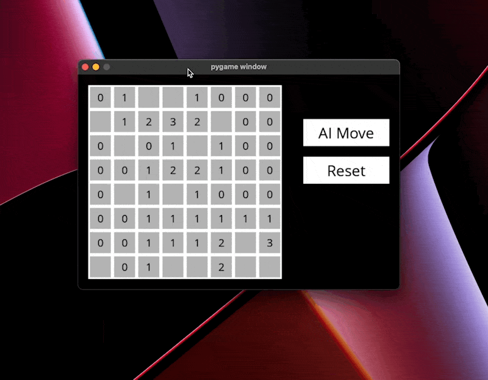

# minesweeper-ai

This project implements a minesweeper AI bot that plays always optimally. Builds propositions of the information that is given, and makes inferences from them.

### Setup
1. Install requirements: `pip install -r requirements.txt`
2. Start playing with `python runner.py`

